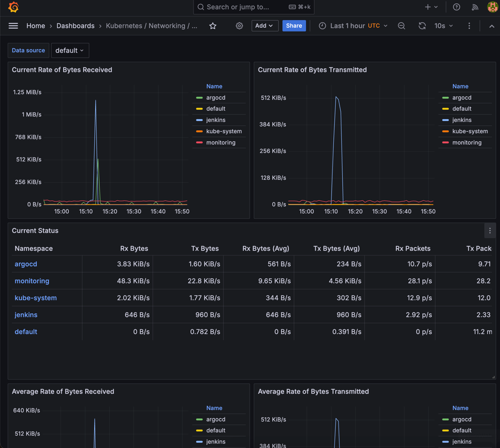
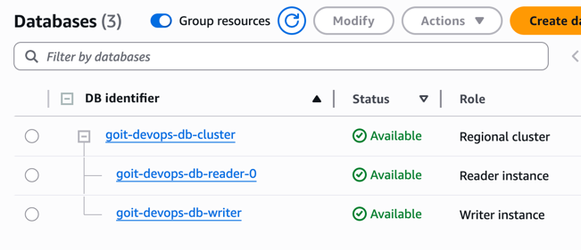
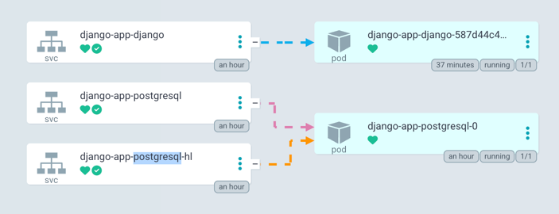
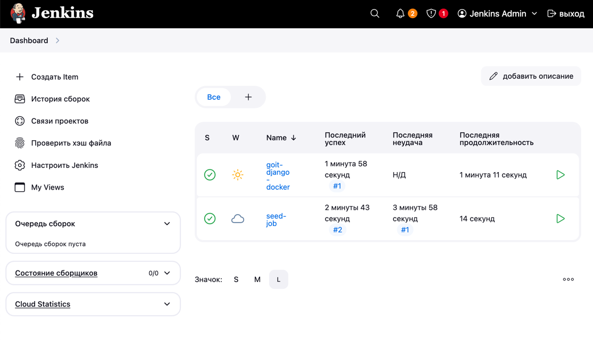
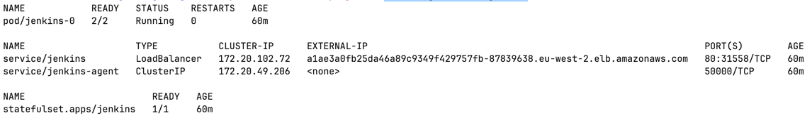
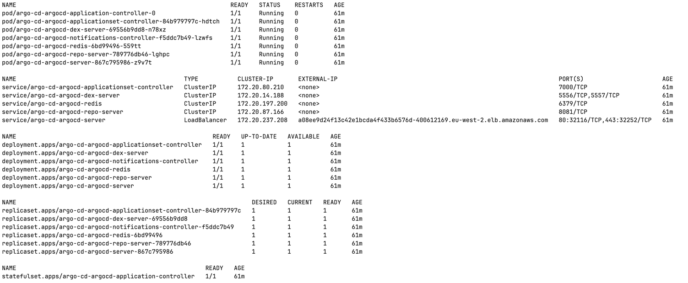
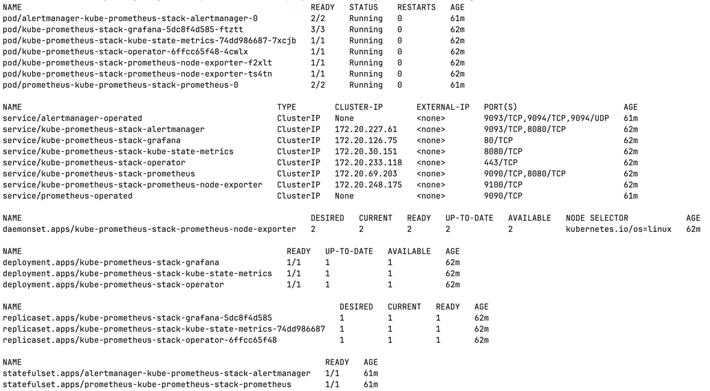

# Final DevOps Project — Terraform + AWS + EKS + Jenkins + Argo CD + Monitoring

## Огляд проєкту

Цей фінальний проєкт демонструє повний цикл DevOps-інфраструктури в AWS з використанням **Terraform** для керування інфраструктурою як кодом.
Середовище включає CI/CD (Jenkins + Argo CD), базу даних (RDS/Aurora), моніторинг (Prometheus + Grafana) та безпечну архітектуру через VPC.

---

## Компоненти інфраструктури

| Компонент                | Технологія / Сервіс               | Опис                                            |
| ------------------------ | --------------------------------- | ----------------------------------------------- |
| **VPC**                  | AWS VPC, Subnets, IGW, NAT        | Безпечна ізольована мережа для всіх компонентів |
| **EKS**                  | Amazon Elastic Kubernetes Service | Оркестрація контейнерів для застосунків         |
| **RDS / Aurora**         | PostgreSQL / Aurora PostgreSQL    | Реляційна база даних для Django-застосунку      |
| **ECR**                  | AWS Elastic Container Registry    | Зберігання Docker-образів                       |
| **Jenkins**              | Helm + Kubernetes                 | CI-сервер для побудови Docker-образів і деплою  |
| **Argo CD**              | Helm + Kubernetes                 | CD-система для автоматичного синку застосунків  |
| **Prometheus + Grafana** | kube-prometheus-stack             | Моніторинг кластера та застосунків              |

---

## Розгортання Terraform

### Ініціалізація середовища

```bash
terraform init
```

### Перевірка плану створення ресурсів

```bash
terraform plan
```

### Розгортання інфраструктури

```bash
terraform apply
```

### Перевірка ресурсів у Kubernetes

```bash
kubectl get nodes
kubectl get all -A
```

---

## Безпека та доступ

* **VPC** із приватними/публічними підмережами
* **Security Groups** відкривають лише необхідні порти:

  * 22 (SSH — опціонально)
  * 80/443 (веб-доступ)
  * 5432 (PostgreSQL)
* **IAM Roles** для EKS та Jenkins (ECR, S3, CloudWatch, RDS)

---

## CI/CD Pipeline

### Jenkins (CI)

1. **Пайплайн:** `modules/jenkins/jobs/goit_django_docker.groovy`
2. **Jenkinsfile:** Знаходиться в корені Django-додатку.
3. **Основні етапи:**

   * Клонування репозиторію
   * Побудова Docker-образу через Kaniko
   * Push образу в ECR
   * Автоматичний синк Argo CD

**Доступ:**

```bash
kubectl port-forward svc/jenkins 8080:80 -n jenkins
```

або через LoadBalancer:

```
http://<jenkins-elb>.eu-west-2.elb.amazonaws.com
```

---

### Argo CD (CD)

1. Автоматично синхронізує Helm-чарти Django-додатку.
2. Репозиторій і Application описані в `modules/argo_cd/charts/`.

**Доступ:**

```bash
kubectl port-forward svc/argo-cd-argocd-server 8081:80 -n argocd
```

або через LoadBalancer:

```
https://<argocd-elb>.eu-west-2.elb.amazonaws.com
```

Пароль:
```bash
kubectl -n argocd get secret argocd-initial-admin-secret -o jsonpath={.data.password} | base64 -d
```

---

## Моніторинг і Grafana

**Prometheus + Grafana** встановлені у namespace `monitoring`:

```bash
kubectl get all -n monitoring
```

**Доступ до Grafana:**

```bash
kubectl port-forward svc/kube-prometheus-stack-grafana 3000:80 -n monitoring
```

Логін і пароль:

```bash
kubectl get secret -n monitoring kube-prometheus-stack-grafana -o jsonpath="{.data.admin-user}" | base64 --decode; echo
kubectl get secret -n monitoring kube-prometheus-stack-grafana -o jsonpath="{.data.admin-password}" | base64 --decode; echo
```

## Скріншоти

| №  | Опис                            |                 Скріншот                             |
|----|---------------------------------| ------------------------------------------------------- |
| 1  | Grafana Dashboard               |                 |
| 2  | AWS Console → RDS               |               |
| 3  | ArgoCD UI                       |                      |
| 4  | Jenkins UI                      |                      |
| 5  | `kubectl get all -n jenkins`    |                      |
| 6  | `kubectl get all -n argocd`     |                      |
| 7  | `kubectl get all -n monitoring` |                      |


---

## Висновок

У цьому проєкті було реалізовано повний DevOps цикл розгортання застосунку в AWS з використанням Terraform, Kubernetes та CI/CD.
Архітектура включає всі основні компоненти сучасного продакшн-середовища:

* VPC — забезпечує ізоляцію та безпеку на мережевому рівні.
* EKS — використовується для оркестрації контейнерів і масштабування застосунків.
* ECR — зберігає Docker-образи, що генеруються через Jenkins pipeline. 
* RDS/Aurora — забезпечує надійну та керовану базу даних PostgreSQL. 
* Jenkins + Argo CD — автоматизують CI/CD процеси, починаючи з білду Docker-образу і закінчуючи деплоєм у кластер. 
* Prometheus + Grafana — реалізують моніторинг стану інфраструктури та застосунку, з можливістю візуалізації метрик і алертингу.
