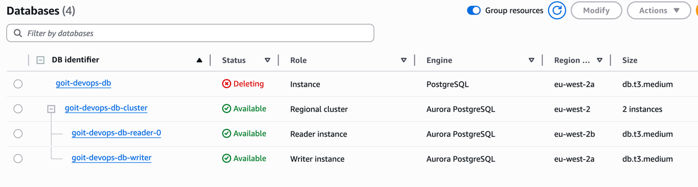

# Модуль Terraform для створення RDS / Aurora PostgreSQL

## Приклад використання модуля

```hcl
module "rds" {
  source = "./modules/rds"

  name                       = "goit-devops-db"
  use_aurora                 = true
  aurora_instance_count      = 2

  # --- Aurora-only ---
  engine_cluster             = "aurora-postgresql"
  engine_version_cluster     = "15.3"
  parameter_group_family_aurora = "aurora-postgresql15"

  # --- RDS-only ---
  engine                     = "postgres"
  engine_version             = "17.2"
  parameter_group_family_rds = "postgres17"

  # Common
  instance_class             = "db.t3.medium"
  allocated_storage          = 20
  db_name                    = "myapp"
  username                   = "postgres"
  password                   = "admin123AWS23"
  subnet_private_ids         = module.vpc.private_subnets
  subnet_public_ids          = module.vpc.public_subnets
  publicly_accessible        = false
  vpc_id                     = module.vpc.vpc_id
  multi_az                   = true
  backup_retention_period    = 7
  parameters = {
    max_connections              = "200"
    log_min_duration_statement   = "500"
  }

  tags = {
    Environment = "dev"
    Project     = "myapp"
  }
}
```

---

## Опис змінних

| Змінна                          | Тип          | Обов’язкова | Опис                                                                  |
| ------------------------------- | ------------ | ----------- | --------------------------------------------------------------------- |
| `name`                          | string       | ✅           | Назва бази даних і пов’язаних ресурсів (SG, subnet group, параметри). |
| `use_aurora`                    | bool         | ✅           | Якщо `true` — створює Aurora кластер, якщо `false` — звичайний RDS.   |
| `aurora_instance_count`         | number       | ❌           | Кількість реплік (читачів) для Aurora.                                |
| `engine`                        | string       | ✅           | Тип рушія для RDS, наприклад `postgres` або `mysql`.                  |
| `engine_version`                | string       | ✅           | Версія рушія RDS (наприклад, `17.2`).                                 |
| `parameter_group_family_rds`    | string       | ✅           | Родина параметрів для RDS, наприклад `postgres17`.                    |
| `engine_cluster`                | string       | ❌           | Тип рушія для Aurora (наприклад `aurora-postgresql`).                 |
| `engine_version_cluster`        | string       | ❌           | Версія Aurora рушія.                                                  |
| `parameter_group_family_aurora` | string       | ❌           | Родина параметрів Aurora.                                             |
| `instance_class`                | string       | ✅           | Тип EC2 інстансу для бази, наприклад `db.t3.medium`.                  |
| `allocated_storage`             | number       | ✅           | Обсяг сховища (у ГБ).                                                 |
| `db_name`                       | string       | ✅           | Ім’я бази даних.                                                      |
| `username`                      | string       | ✅           | Ім’я користувача адміністратора.                                      |
| `password`                      | string       | ✅           | Пароль адміністратора бази даних.                                     |
| `vpc_id`                        | string       | ✅           | Ідентифікатор VPC, у якому створюється база.                          |
| `subnet_private_ids`            | list(string) | ✅           | Ідентифікатори приватних підмереж.                                    |
| `subnet_public_ids`             | list(string) | ✅           | Ідентифікатори публічних підмереж.                                    |
| `publicly_accessible`           | bool         | ✅           | Дозволяє або забороняє публічний доступ до БД.                        |
| `multi_az`                      | bool         | ❌           | Якщо `true`, створюється багатозонна реплікація.                      |
| `backup_retention_period`       | number       | ❌           | Кількість днів збереження бекапів.                                    |
| `parameters`                    | map(string)  | ❌           | Налаштування параметрів рушія (наприклад, `max_connections`).         |
| `tags`                          | map(string)  | ❌           | Користувацькі теги для ресурсів.                                      |

---

## Як змінити тип бази або параметри

### Звичайна RDS PostgreSQL

```hcl
use_aurora = false
engine = "postgres"
engine_version = "17.2"
instance_class = "db.t3.medium"
```

### Aurora PostgreSQL

```hcl
use_aurora = true
engine_cluster = "aurora-postgresql"
engine_version_cluster = "15.3"
parameter_group_family_aurora = "aurora-postgresql15"
```

> 💡 Порада: Aurora підтримує кілька інстансів (writer + читачі), тоді як звичайний RDS — лише один.

---

### Зміна типу або класу інстансу

* **Змінити тип рушія:** просто змініть `engine` або `engine_cluster`.
* **Оновити версію рушія:** змініть `engine_version` або `engine_version_cluster`.
* **Змінити клас інстансу:** оновіть `instance_class`, наприклад:

  ```hcl
  instance_class = "db.t3.large"
  ```
* **Змінити кількість реплік Aurora:**

  ```hcl
  aurora_instance_count = 3
  ```

---

## Додаткова інформація

* Якщо використовується `publicly_accessible = true`, необхідно мати Internet Gateway у VPC.
* Для середовища розробки рекомендовано ставити `skip_final_snapshot = true`.
* Aurora автоматично створює writer + reader, якщо вказано `aurora_instance_count > 1`.

---

## Приклади команд

```bash
terraform init
terraform plan -target="module.rds"
terraform apply -target="module.rds"
terraform destroy -target="module.rds"
```

---

## Підсумок

Модуль підтримує **дві архітектури БД**:

* Стандартна RDS PostgreSQL
* Aurora PostgreSQL Cluster



Вибір режиму здійснюється просто через прапорець `use_aurora`. Це дозволяє зручно переходити від одиночного інстансу до масштабованого кластера без зміни логіки застосунку.
